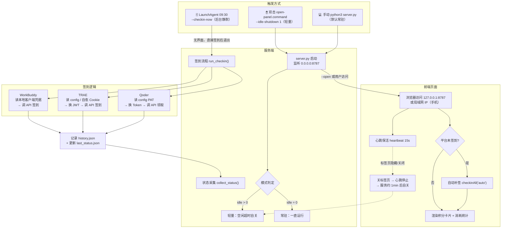

# AI 积分签到面板（WorkBuddy / TRAE / Qoder）

本地 Web 面板：一个页面一键签到三个平台，显示各平台剩余积分、资源包明细、到期时间，以及**今日总消耗积分**与**三平台消耗占比**（基于每日用量基线差值统计）。

## 系统流程



## 启动

> 项目路径每台机器不同，下面用 `$PROJECT_DIR` 指代你本机的项目根目录。默认位置通常是 `$HOME/.zcode/workspace/default/checkin-panel`；若不在该处，用 `find ~ -type d -name checkin-panel -path "*zcode*"` 查找，再把 `$PROJECT_DIR` 换成真实路径。

```bash
cd "$PROJECT_DIR"   # 或 cd 进你找到的项目目录
python3 server.py
# 本机打开 http://127.0.0.1:8787
```

## 手机 / 平板访问（同一 WiFi）

服务监听 `0.0.0.0:8787`，启动时终端会打印一行「手机/平板访问: http://<本机局域网IP>:8787」，在手机浏览器里输入该地址即可，功能与电脑端完全一致（签到、积分明细、设置、历史）。

- 手机不能访问 `127.0.0.1`——那是回环地址，指的是手机自己，必须用 Mac 的局域网 IP。
- 首次启动 macOS 防火墙可能弹窗，点「允许」Python 接收传入连接。
- 局域网 IP 由路由器 DHCP 分配，重连/重启可能变动，建议在路由器里给 Mac 绑定静态 IP。
- **手机端建议用常驻模式**（`python3 server.py` 或常驻 plist）。轻量模式靠页面心跳保活，手机锁屏/切走 App 时页面转为不可见、心跳停止，服务约 1 分钟后会自动关停。
- 安全提醒：面板无登录鉴权，同一局域网内任何设备都能触发签到 / 改配置 / 停服务。只在可信的家庭网络开启，咖啡店、公司等公共网络下不要暴露。
- 页面已做窄屏适配（≤520px 单列布局、输入框 16px 防 iOS 聚焦放大），无需额外配置。

## 三个平台的凭据来源

| 平台 | 凭据 | 维护成本 |
|---|---|---|
| WorkBuddy | 自动 | **零维护**：自动读取本机 WorkBuddy 客户端登录凭据（`~/Library/Application Support/CodeBuddyExtension/Data/Public/auth/workbuddy-desktop.info`），客户端保持登录即可 |
| TRAE | X-Cloudide-Session | **近乎零维护**：登录失效时卡片出现「🔄 重新登录（自动获取）」按钮 → 点它 → 在弹出页面正常登录 → 面板自动从 ZCode 内置浏览器的会话存储拿最新凭据（`~/Library/Application Support/ZCode/session/Partitions/zcode-embedded-browser/Cookies`），无需复制粘贴。每天 09:30 的定时签到也会先尝试无感自愈 |
| Qoder | PAT | **一年一次**：令牌失效时卡片出现「🔗 打开令牌页面」→ 新建令牌 → 复制 → 「手动录入」粘贴（`qoder.cn/account/integrations`） |

手动录入入口在「⚙️ 设置」，仅作为自动获取失败时的备用通道。

## TRAE 会话获取机制

### 自动获取（推荐）

面板默认从 **ZCode 内置浏览器** 读取 TRAE 会话串（`X-Cloudide-Session`），实现零维护自动愈合：

- **数据源**：`~/Library/Application Support/ZCode/session/Partitions/zcode-embedded-browser/Cookies`
- **原理**：ZCode 内置浏览器使用**明文字段存储** Cookie，Python 可直接读取
- **触发时机**：
  - 配置中无会话串时
  - 会话串失效（JWT 验证失败）时
  - 手动点击 TRAE 卡片「🔄 重新登录」后

### 浏览器来源配置

在「⚙️ 设置」→ TRAE 区块可切换「浏览器来源」：

| 来源 | 说明 | 自动读取 |
|---|---|---|
| **ZCode 内置浏览器** | 推荐，明文存储可直接读 | ✓ |
| Chrome | macOS Keychain 加密，无法自动读取 | ✗ |
| Safari | macOS Keychain 加密，无法自动读取 | ✗ |
| 手动模式 | 需手动粘贴会话串 | ✗ |

> ⚠️ **macOS 安全限制**：Chrome/Safari 的 Cookie 被系统 Keychain 加密存储，Python 无法直接读取明文值。如需使用这些浏览器，请切换到「手动模式」并定期手动粘贴会话串（约 14 天过期）。

### 手动模式

如果未来不使用 ZCode，可切换到「手动模式」：

1. 在「⚙️ 设置」→ TRAE 区块选择「手动模式」
2. 登录 trae.cn → F12 → Application → Cookies → 复制 `X-Cloudide-Session`
3. 粘贴到输入框 → 保存
4. 约 14 天后会话过期，需重复上述步骤

### 测试会话有效性

设置弹窗中提供「🔍 测试当前会话是否有效」按钮，点击可验证当前配置的会话串是否有效。

## 自动签到（每天定时，无需开面板）

> ⚠️ **激活方式（实测）**：在本机 macOS 上，`launchctl bootstrap` 与旧版 `launchctl load` 把任务注册到 `gui/$UID` 都会报 `Bootstrap failed: 5: Input/output error`（即使 plist 经 `plutil -lint` 校验合法、权限正常）。**不要依赖 bootstrap**——把 plist 放进 `~/Library/LaunchAgents/` 后，**注销并重新登录（或重启）一次**，macOS 会自动加载，这是最可靠的方式（zsh 里 `$UID` 是只读变量，`UID=$(id -u)` 报错不影响，bootstrap 用的是内置 `$UID`）。

### 方式一：每天 09:30 自动签到（连网页都不用开）

```bash
# 自带的 plist 写死了原作者的用户名和 python 路径，换电脑请用下面命令按本机重新生成
PY=$(command -v python3)
sed -e "s#/Users/honghonghuan/.zcode/workspace/default/checkin-panel#$PROJECT_DIR#g" \
    -e "s#/opt/homebrew/bin/python3#$PY#g" \
    com.user.checkin-panel.plist > ~/Library/LaunchAgents/com.user.checkin-panel.plist
# 立即激活（若 bootstrap 报 I/O error，注销/重启一次即可，LaunchAgents 会自动加载）
UID=$(id -u)
launchctl bootstrap "gui/$UID" ~/Library/LaunchAgents/com.user.checkin-panel.plist 2>/dev/null || echo "请在本机终端执行，或注销后自动生效"
# 查看日志
cat /tmp/checkin-panel.log
# 卸载
launchctl bootout "gui/$UID/com.user.checkin-panel" 2>/dev/null
rm ~/Library/LaunchAgents/com.user.checkin-panel.plist
```

### 默认·轻量模式：只在签到前后短暂运行，平时不常驻

面板服务**默认不再常驻后台**（解决“一直挂后台费电/占资源”的顾虑）。两种触发方式：

1. **按需打开（推荐，一键）**：双击项目里的 `open-panel.command`（macOS 会在终端里运行它）。它会：若面板已在运行就直接打开浏览器；否则以「关标签页即停」的轻量模式启动并打开浏览器。网页开着时心跳保活（页面可见每 15 秒上报一次），**关闭/隐藏标签页约 1 分钟后服务自动退出**，几乎不占资源、不耗电。
2. **每日签到后短暂自启**：安装下面的轻量 plist，每天 09:32 自动起一次服务（`--idle-shutdown 1`，网页关闭后约 1 分钟自动关），方便你早上看一眼当天签到结果。

```bash
# 轻量版服务 plist（无 KeepAlive、无 RunAtLoad → 不常驻，仅每日 09:32 短暂启动）
PY=$(command -v python3)
sed -e "s#/Users/honghonghuan/.zcode/workspace/default/checkin-panel#$PROJECT_DIR#g" \
    -e "s#/opt/homebrew/bin/python3#$PY#g" \
    com.user.checkin-panel.server.plist > ~/Library/LaunchAgents/com.user.checkin-panel.server.plist
UID=$(id -u)
launchctl bootstrap "gui/$UID" ~/Library/LaunchAgents/com.user.checkin-panel.server.plist 2>/dev/null || echo "请在本机终端执行，或注销后自动生效"
```

> 小提示：plist 放进 `~/Library/LaunchAgents/` 后，**下次登录会自动加载**，不手动 bootstrap 也行（直接注销/重启一次最省事）。若 `bootstrap` 报 `Bootstrap failed: 5: Input/output error`，忽略即可，注销/重启后 LaunchAgents 仍会自动加载。

### 一键开关（开 / 关）+ 模式切换

- **开**：双击 `open-panel.command`（任意时刻都能起，默认轻量模式）。
- **关（方式一·自动）**：关闭或隐藏网页标签页，约 1 分钟后服务自动退出（页面可见时心跳保活，关标签页后心跳停止 → 空闲阈值到 → 自动关停，即“关标签页即停”）。
- **关（方式二·手动）**：在网页里点右上角「⏻ 停止服务」立即关闭。
- **模式切换（轻量 ⇄ 常驻）**：网页右上角有「🍃 轻量 / 🔒 常驻」按钮，点一下即可在两种模式间实时切换，**无需重启**：
  - **轻量**（默认）：关标签页即停，平时不占资源、不耗电。
  - **常驻**：切到此后，即使关闭/隐藏标签页服务也一直运行，链接随时可访问（适合“想常驻、每次点链接都能进”的场景）。
  - 切换是运行时生效的；若重启服务（或重启电脑），会回到默认的轻量模式。

> 关于“关标签页即停”的几个要点：
> - **刷新网页不会误杀服务**：刷新时旧页面卸载、新页面加载，重载间隙很短（远小于 1 分钟空闲阈值），新页面加载即上报心跳，服务保持存活。
> - **切到别的标签页（隐藏）也会在约 1 分钟后停止**——这是轻量模式的预期行为（不常驻）。回来时双击 `open-panel.command` 重新打开即可。
> - 「⏻ 停止服务」按钮**仅对轻量模式有效**。若处于常驻模式（plist 带 `KeepAlive`），服务停止后会被 launchd 立即重启，按钮会提示“仍被自动重启”；彻底停止常驻需先关闭/移除该 plist 再注销重启。另外，按钮依赖后端 `/api/shutdown` 接口，需服务器加载了含该接口的新代码（注销/重启后）才生效——旧代码上点它会提示“停止失败”。

### 可选·常驻模式：开机自启、随时可访问

若你更想要“网页永远开着就能访问”，把上面的轻量 plist 换成常驻版（加回 `RunAtLoad` + `KeepAlive`）：

```bash
PY=$(command -v python3)
cat > ~/Library/LaunchAgents/com.user.checkin-panel.server.plist <<EOF
<?xml version="1.0" encoding="UTF-8"?>
<!DOCTYPE plist PUBLIC "-//Apple//DTD PLIST 1.0//EN" "http://www.apple.com/DTDs/PropertyList-1.0.dtd">
<plist version="1.0"><dict>
  <key>Label</key><string>com.user.checkin-panel.server</string>
  <key>ProgramArguments</key><array><string>$PY</string><string>$PROJECT_DIR/server.py</string></array>
  <key>RunAtLoad</key><true/><key>KeepAlive</key><true/>
  <key>StandardOutPath</key><string>/tmp/checkin-panel-server.log</string>
  <key>StandardErrorPath</key><string>/tmp/checkin-panel-server.log</string>
</dict></plist>
EOF
UID=$(id -u)
launchctl bootstrap "gui/$UID" ~/Library/LaunchAgents/com.user.checkin-panel.server.plist 2>/dev/null || echo "请在本机终端执行，或注销后自动生效"
```

> 从旧版（常驻）切换到轻量：先把轻量 plist 覆盖到 `~/Library/LaunchAgents/`，再注销/重启一次让新配置生效；当前已在跑的常驻进程可点网页「⏻ 停止服务」立即关掉。

另外：打开面板页面时，如有平台当天未签到会**自动补签**。

## 文件说明

- `server.py` — 面板服务（纯 Python 标准库，无依赖），监听 `0.0.0.0`（本机 127.0.0.1 + 同 WiFi 的设备均可访问）。运行模式：`--idle-shutdown N`（轻量，空闲 N 分钟自动关）、`--resident`（常驻）、`--open`（启动并开浏览器）、`--checkin-now`（仅签到后退出）。运行时也可在网页点「🍃 轻量 / 🔒 常驻」按钮实时切换模式（无需重启）。
- `index.html` — 前端页面
- `open-panel.command` — 一键打开面板的启动脚本（macOS 双击即用，轻量模式）
- `link.svg` — 页面 favicon（链接图标；由原 `苹果.svg` 替换而来，服务端仅白名单放行此文件，避免泄露 `config.json` 等同目录密钥）
- `config.json` — 凭据保存处（权限 600，仅本机可读；请勿外传）
- `history.json` — 签到历史；`last_status.json` — 最近一次状态缓存；`daily_baseline.json` — 每日消耗基线（用于统计今日总消耗，运行时生成）

## ⚠️ 风险提示

这些接口是从各平台客户端逆向得到的非官方接口，平台可能随时调整（参数/路径/风控），届时签到会失败并在面板显示错误信息。自动签到属于个人账号的日常操作，风险总体较低（WorkBuddy 的 status 接口自身就带 streak 记录，说明平台对签到有正常预期），但请知悉：
1. 使用非官方接口理论上违反平台服务条款，存在账号被限制的理论风险；
2. 凭据保存在本机 `config.json`（TRAE 会话串、Qoder PAT），不要把该文件或整个目录发给别人；
3. TRAE 会话串 14 天过期是设计内行为，面板会明确提示重新获取。

## 文档地图

- 《配置使用指南.md》— 用户向：配置、使用、常见问题
- 《AI一键运行指南.md》— AI 运维手册：一键跑通、自愈、定时任务
- 《接口参考与Windows适配.md》— 开发者向：三平台上游接口实测细节与坑、Windows 适配评估、接手 AI 的维护注意事项
